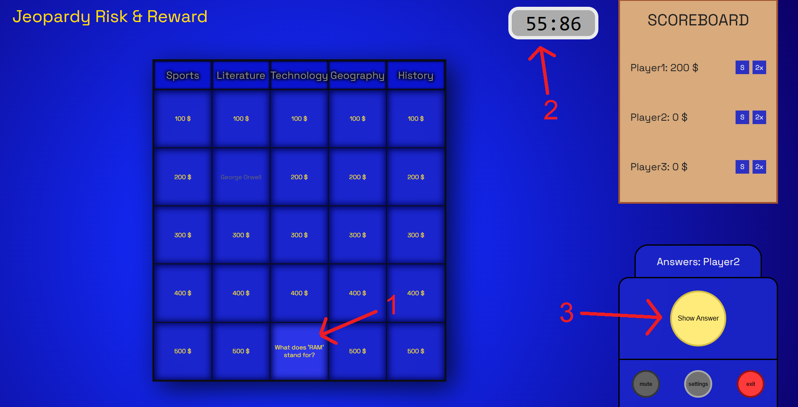
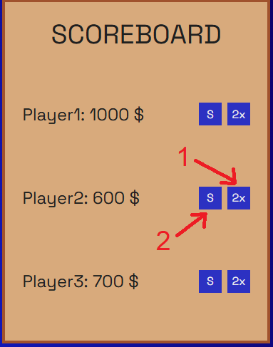
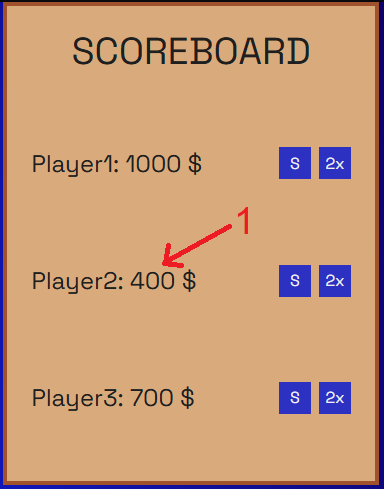

# Jeopardy Risk & Reward

This classic game of Jeopardy was mixed with some additional elements which players can use in order to **boost** their in-game experience and provide yourself a better chance of winning!
<br>
<br>
> [!IMPORTANT]
> The game is fully controlled by host. <br>
> Host does all actions by talking with players real-time.

> [!WARNING]
> Buttons **Mute**, **Settings** and **Exit** do not work for now. To be added.

<br>
<br>
<br>

# GAME CYCLE:

## Initial screen:


<br>
<br>
<br>

## Starting the game:

1. Player picks the prize in specific category and the host shows the question hidden under it by clicking on the chosen tile.
2. The timer starts counting down when the tile is clicked.
3. Monitor shows the action that is now happening f.e. who is now answering or choosing next tile.
4. The host has now option to show answer by clicking yellow button (should happen when player tells the answer).

<br>
<br>
<br>

## Answering the question:

1. After host shows the answer it can be seen in the tile.
2. The timer immediately stops after showing the answer.
3. Now host can decide if the answer was correct or wrong - here the player can defend he/she is right!

<br>
<br>
<br>

## Correct answer:

1. If the answer was correct the money from the tile is added to the player's balance.
2. Now the next player chooses tile with prize.

<br>
<br>
<br>

## Second question:

1. Next player picks next tile.
2. The timer is restarted when the tile is clicked.
3. The host again has option to show answer.

<br>
<br>
<br>

## Second answer:

1. The host again needs to decide if the answer was correct or wrong.

<br>
<br>
<br>

## Bad answer:

1. If the answer was wrong, player's balance does not change.
2. Next player chooses next tile with prize... and so on.

<br>
<br>
<br>

# BOOSTS:

1. Double Reward - by default costs 200$ and grants doubled reward for next tile if answered correctly. If answered wrong the boost is lost and does not give anything.
2. Stealopardy - by default costs 500$ and if the next tile is answered correctly it gives the prize for the tile **AND** automatically steals the same amount of money as the tile prize from **ALL** other player's balance. The higher the prize, the higher the robbery!

<br>


1. Using Double Reward boost immediately takes 200$ from player's balance and activates for next tile (if the player has enough money).

<br>
<br>
<br>

# GAME SETTINGS:
Most of the game setting can be simply changed at the top of *App.jsx* file (for now - user settings gui is going to be added).
Code responsible for game settings with short explaination below:
```
const gameSettings = {
    numberOfCategories: 5,          // number of columns in Jeopardy grid
    numberOfRowsInCategory: 5,      // number of rows in Jeopardy grid
    categoryStartingMoney: 100,     // amount of money that the tile prizes start from
    categoryMoneyIncreasesBy: 100,  // amount of money that each row of tiles increases by
    timeToAnswer: 70,               // amount of time to answer the question (in seconds)
    playersCount: 3,                // amount of players participating in game
    doubleNextRewardBoostCost: 200, // cost of the Double Reward boost
    stealMoneyBoostCost: 500        // cost of the Stealopardy boost
};
```

> [!IMPORTANT]
>  for now, there is no dynamic generation of players, more players need to be added below game settings

<br>

## Example of different prizes:
In the example below, you can see how changing the values of *categoryStartingMoney* and *categoryMoneyIncreasesBy* to **200** changes the Jeopardy grid. 
<br>


<br>
<br>
<br>

# RESPONSIVENESS:
The game can be played with only half screen if the host needs to have some additional info on the other half of the monitor.

<br>

## Half of the screen window example:


<br>

> [!NOTE]
> It is possible to make the window smaller, but <ins>IT IS NOT</ins> fully responsive (for now). Example below.

<br>

## Quarter of the screen window example:


<br>
<br>
<br>

# SETUP
> [!WARNING]
> Node.js added to PATH required for launching the application.

<br>

1. Download the **.zip** of the whole repository
2. Unzip the file in desired location
3. Launch CMD/Terminal in folder *Jeopardy-Risk-And-Reward*
4. Run command as shown below:
```
npm install
```
5. After last command is finished run command as shown below:
```
npm run dev
```
6. In desired browser connect to *https://localhost:5173/*
7. Congratulations! You are ready to host the game!


